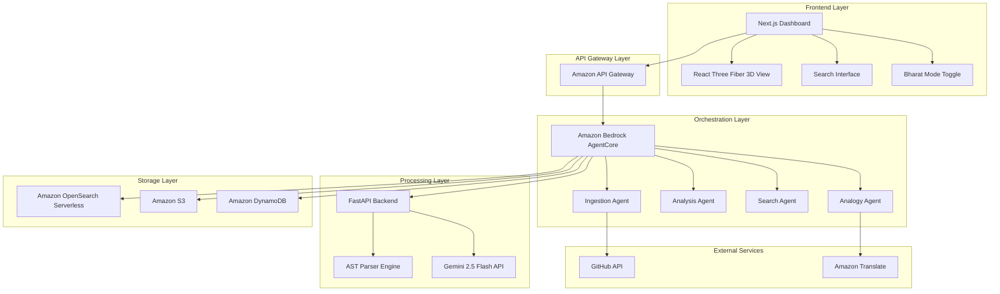
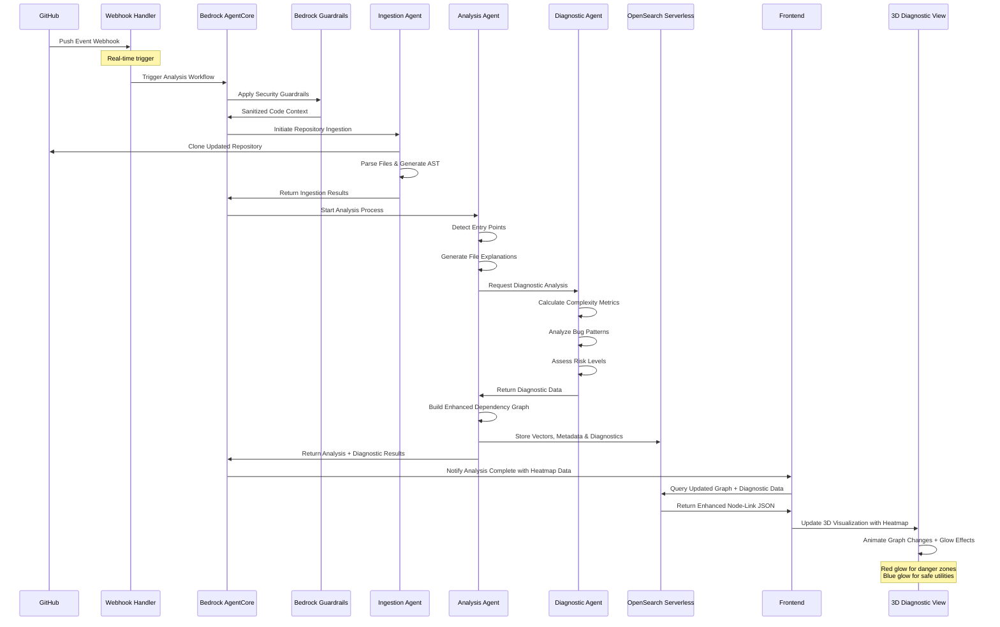
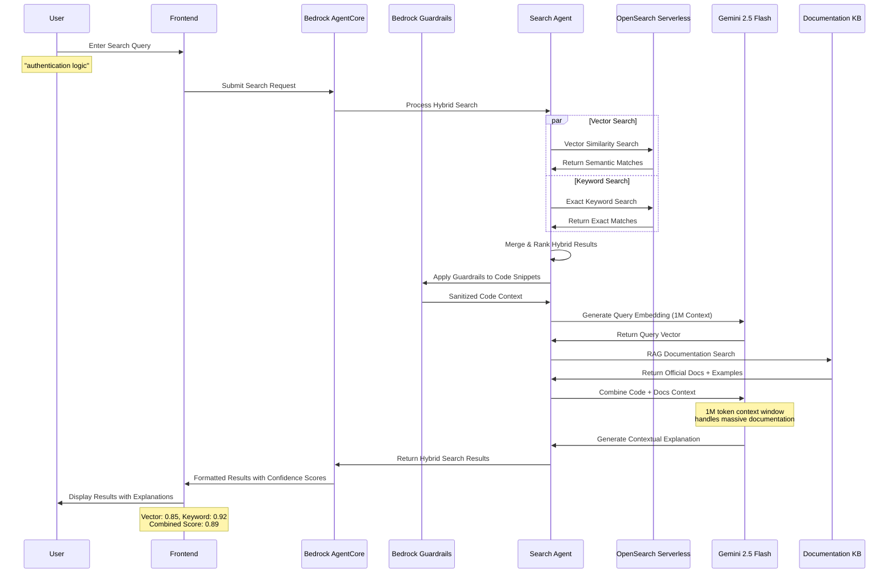

# Design Document: CodeDrishti

## Overview

CodeDrishti is an AI-powered codebase understanding platform designed for the AWS AI for Bharat 2026 hackathon. The system leverages a Multi-Agent architecture orchestrated by Amazon Bedrock AgentCore to help developers understand unfamiliar codebases through automated analysis, 3D visualization, and culturally-aware explanations.

The platform combines advanced AI capabilities with Indian cultural context to make complex software concepts accessible to students and junior developers across India, supporting the "Learn Faster" and "Work Smarter" mission through intelligent code analysis and natural language explanations.

## Architecture

### System Architecture Overview

CodeDrishti employs a Multi-Agent system architecture with Amazon Bedrock AgentCore serving as the central orchestrator. The system is designed for scalability, real-time processing, and seamless integration with AWS services.



### Multi-Agent System Design

The system employs four specialized agents coordinated by Amazon Bedrock AgentCore:

1. **Ingestion Agent**: Handles repository cloning, file processing, and initial analysis
2. **Analysis Agent**: Performs deep code analysis, entry point detection, and explanation generation
3. **Search Agent**: Manages semantic search and RAG-based documentation retrieval
4. **Analogy Agent**: Generates culturally-aware explanations using Indian metaphors

## Components and Interfaces

### Frontend Components (Next.js + TypeScript)

#### Dashboard Interface
```typescript
interface DashboardProps {
  repository: Repository;
  analysisResults: AnalysisResult[];
  searchQuery: string;
  bharatMode: boolean;
}

interface Repository {
  id: string;
  name: string;
  url: string;
  language: string;
  entryPoints: EntryPoint[];
  fileCount: number;
  lastAnalyzed: Date;
}
```

#### 3D Diagnostic Visualization Component
```typescript
interface Node3D {
  id: string;
  name: string;
  type: 'entry' | 'utility' | 'infrastructure';
  position: [number, number, number];
  connections: string[];
  metadata: FileMetadata;
  diagnostics: NodeDiagnostics;
}

interface NodeDiagnostics {
  complexity_score: number; // 0.0 to 1.0
  bug_density: number; // Historical bug count per LOC
  heat_level: 'safe' | 'caution' | 'danger'; // Blue, Yellow, Red
  glow_intensity: number; // 0.0 to 1.0 for visual emphasis
  risk_factors: string[]; // ["high_complexity", "frequent_changes", "no_tests"]
}

interface Graph3D {
  nodes: Node3D[];
  edges: Edge3D[];
  layout: 'force-directed' | 'hierarchical' | 'circular';
  heatmap_overlay: HeatmapConfig;
}

interface HeatmapConfig {
  enabled: boolean;
  mode: 'complexity' | 'bugs' | 'changes' | 'combined';
  color_scheme: {
    safe: '#4CAF50';      // Blue-Green for simple utilities
    caution: '#FF9800';   // Orange for moderate complexity
    danger: '#F44336';    // Red for danger zones
  };
}
```

### Backend Components (FastAPI + Python)

#### Repository Ingestion Service
```python
class IngestionEngine:
    def __init__(self, bedrock_client: BedrockClient):
        self.bedrock = bedrock_client
        self.ast_parser = ASTParser()
        
    async def ingest_repository(self, repo_url: str) -> IngestionResult:
        """Clones and processes repository files"""
        pass
        
    async def scan_local_directory(self, path: str) -> IngestionResult:
        """Scans local filesystem for code files"""
        pass
```

#### Analysis Engine Service
```python
class AnalysisEngine:
    def __init__(self, gemini_client: GeminiClient, opensearch_client: OpenSearchClient):
        self.gemini = gemini_client
        self.opensearch = opensearch_client
        
    async def detect_entry_points(self, files: List[CodeFile]) -> List[EntryPoint]:
        """Identifies main entry points using AST analysis"""
        pass
        
    async def generate_file_explanation(self, file: CodeFile) -> FileExplanation:
        """Generates natural language explanation using Gemini 2.5 Flash"""
        pass
```

#### Enhanced Search Engine with Hybrid Search
```python
class SearchEngine:
    def __init__(self, opensearch_client: OpenSearchClient):
        self.opensearch = opensearch_client
        
    async def hybrid_search(self, query: str, repository_id: str) -> List[SearchResult]:
        """Performs hybrid vector + keyword search for optimal accuracy"""
        
        # Combine vector similarity with exact keyword matching
        vector_results = await self._vector_search(query, repository_id)
        keyword_results = await self._keyword_search(query, repository_id)
        
        # Merge and rank results using hybrid scoring
        return self._merge_hybrid_results(vector_results, keyword_results)
        
    async def rag_documentation_search(self, code_snippet: str) -> List[DocReference]:
        """Retrieves relevant documentation using RAG with Bedrock Guardrails"""
        
        # Apply Bedrock Guardrails to prevent sensitive code leakage
        sanitized_snippet = await self._apply_guardrails(code_snippet)
        return await self._perform_rag_search(sanitized_snippet)
        
    async def _apply_guardrails(self, code_snippet: str) -> str:
        """Uses Amazon Bedrock Guardrails to sanitize code before external processing"""
        pass
```

### AWS Infrastructure Components

#### Amazon Bedrock AgentCore Configuration with Guardrails
```json
{
  "agentName": "CodeDrishtiOrchestrator",
  "agentResourceRoleArn": "arn:aws:iam::account:role/CodeDrishtiAgentRole",
  "foundationModel": "anthropic.claude-3-sonnet-20240229-v1:0",
  "instruction": "Orchestrate code analysis workflow across ingestion, analysis, and search agents with security guardrails",
  "guardrailConfiguration": {
    "guardrailIdentifier": "codedrishti-security-guardrails",
    "guardrailVersion": "1"
  },
  "actionGroups": [
    {
      "actionGroupName": "IngestionActions",
      "actionGroupExecutor": {
        "lambda": "arn:aws:lambda:region:account:function:codedrishti-ingestion"
      }
    },
    {
      "actionGroupName": "AnalysisActions", 
      "actionGroupExecutor": {
        "lambda": "arn:aws:lambda:region:account:function:codedrishti-analysis"
      }
    },
    {
      "actionGroupName": "BharatModeActions",
      "actionGroupExecutor": {
        "lambda": "arn:aws:lambda:region:account:function:codedrishti-analogy"
      }
    }
  ]
}
```

#### Amazon OpenSearch Serverless with Hybrid Search Configuration
```yaml
Collection:
  Name: codedrishti-vectors
  Type: VECTORSEARCH
  
IndexTemplate:
  name: code-embeddings-hybrid
  mappings:
    properties:
      file_path:
        type: keyword
      content_vector:
        type: knn_vector
        dimension: 1536
        method:
          name: hnsw
          space_type: cosinesimil
      explanation_vector:
        type: knn_vector
        dimension: 1536
      # Hybrid search fields
      function_names:
        type: text
        analyzer: code_analyzer
      class_names:
        type: keyword
      import_statements:
        type: text
      # Diagnostic fields for heatmap
      complexity_score:
        type: float
      bug_density:
        type: float
      change_frequency:
        type: integer
      
SearchConfiguration:
  hybrid_search:
    vector_weight: 0.7
    keyword_weight: 0.3
    boost_exact_matches: true
```

#### Bedrock Guardrails Configuration
```json
{
  "guardrailName": "codedrishti-security-guardrails",
  "description": "Prevents sensitive code leakage and ensures safe AI processing",
  "topicPolicyConfig": {
    "topicsConfig": [
      {
        "name": "SensitiveCode",
        "definition": "API keys, passwords, private keys, database credentials",
        "examples": ["AWS_SECRET_ACCESS_KEY", "password=", "private_key"],
        "type": "DENY"
      }
    ]
  },
  "contentPolicyConfig": {
    "filtersConfig": [
      {
        "type": "HATE",
        "inputStrength": "HIGH",
        "outputStrength": "HIGH"
      }
    ]
  },
  "wordPolicyConfig": {
    "wordsConfig": [
      {
        "text": "TODO: REMOVE BEFORE PRODUCTION"
      }
    ],
    "managedWordListsConfig": [
      {
        "type": "PROFANITY"
      }
    ]
  }
}

## Data Models

### Core Data Structures

#### Repository Model
```python
@dataclass
class Repository:
    id: str
    name: str
    url: Optional[str]
    local_path: Optional[str]
    language: str
    framework: Optional[str]
    entry_points: List[EntryPoint]
    file_tree: FileTree
    analysis_status: AnalysisStatus
    created_at: datetime
    last_analyzed: datetime
```

#### File Analysis Model
```python
@dataclass
class FileAnalysis:
    file_path: str
    file_type: str
    language: str
    explanation: str
    key_functions: List[Function]
    dependencies: List[str]
    complexity_score: float
    entry_point_likelihood: float
    embedding_vector: List[float]
```

#### Enhanced 3D Graph Export Schema with Diagnostic Heatmap
```json
{
  "graph": {
    "metadata": {
      "repository": "example/microservices-app",
      "analysis_timestamp": "2024-01-15T10:30:00Z",
      "total_files": 156,
      "languages": ["Python", "JavaScript", "Go"],
      "heatmap_mode": "complexity"
    },
    "nodes": [
      {
        "id": "src/main.py",
        "name": "main.py",
        "type": "entry",
        "color": "#ff4444",
        "position": [0, 0, 0],
        "metadata": {
          "lines": 150,
          "functions": 5,
          "complexity": 0.7,
          "language": "Python"
        },
        "diagnostics": {
          "complexity_score": 0.85,
          "bug_density": 0.12,
          "heat_level": "danger",
          "glow_intensity": 0.9,
          "risk_factors": ["high_complexity", "frequent_changes", "no_tests"],
          "recommendations": [
            "Consider breaking down large functions",
            "Add unit tests for critical paths",
            "Review recent changes for potential issues"
          ]
        }
      },
      {
        "id": "src/utils/helpers.py",
        "name": "helpers.py", 
        "type": "utility",
        "color": "#4444ff",
        "position": [2, 1, 0],
        "metadata": {
          "lines": 45,
          "functions": 8,
          "complexity": 0.2,
          "language": "Python"
        },
        "diagnostics": {
          "complexity_score": 0.15,
          "bug_density": 0.02,
          "heat_level": "safe",
          "glow_intensity": 0.1,
          "risk_factors": [],
          "recommendations": ["Well-structured utility functions"]
        }
      }
    ],
    "edges": [
      {
        "source": "src/main.py",
        "target": "src/utils/helpers.py",
        "type": "import",
        "weight": 0.8,
        "relationship": "depends_on",
        "import_count": 3
      }
    ],
    "layout": "force-directed",
    "physics": {
      "attraction": 0.1,
      "repulsion": 100,
      "damping": 0.9
    },
    "heatmap": {
      "enabled": true,
      "mode": "complexity",
      "legend": {
        "safe": {"color": "#4CAF50", "description": "Low complexity, stable code"},
        "caution": {"color": "#FF9800", "description": "Moderate complexity, monitor changes"},
        "danger": {"color": "#F44336", "description": "High complexity, needs attention"}
      },
      "statistics": {
        "safe_nodes": 89,
        "caution_nodes": 45,
        "danger_nodes": 22,
        "avg_complexity": 0.34
      }
    }
  }
}
```

### Bharat Mode Data Structures

#### Enhanced Cultural Analogy Model with Conceptual Mapping
```python
@dataclass
class CulturalAnalogy:
    technical_concept: str  # e.g., "Kubernetes Pod"
    indian_metaphor: str   # e.g., "Mumbai Dabbawala System"
    conceptual_mapping: ConceptualMapping
    explanation: str       # Full analogy explanation
    language: str         # Hindi, Tamil, Odia, etc.
    accuracy_score: float # Technical accuracy (0.0-1.0)
    accessibility_score: float # Cultural accessibility (0.0-1.0)

@dataclass 
class ConceptualMapping:
    """Maps technical functions to cultural equivalents"""
    technical_function: str    # "Container orchestration"
    cultural_function: str     # "Dabba organization and delivery"
    shared_principles: List[str] # ["grouping", "scheduling", "resource_sharing"]
    key_differences: List[str]   # ["digital vs physical", "automated vs manual"]
    why_analogy_works: str      # Explanation of functional similarity

@dataclass
class MultilingualExplanation:
    original_concept: str
    english_explanation: str
    translations: Dict[str, str]  # language_code -> translated_text
    cultural_analogies: List[CulturalAnalogy]
    complexity_level: str  # beginner, intermediate, advanced
    target_audience: str   # "engineering_students", "junior_developers", "senior_engineers"
```

#### Diagnostic Analysis Model
```python
@dataclass
class FileAnalysis:
    file_path: str
    file_type: str
    language: str
    explanation: str
    key_functions: List[Function]
    dependencies: List[str]
    
    # Enhanced diagnostic fields
    complexity_metrics: ComplexityMetrics
    quality_metrics: QualityMetrics
    risk_assessment: RiskAssessment
    embedding_vector: List[float]

@dataclass
class ComplexityMetrics:
    cyclomatic_complexity: int
    cognitive_complexity: int
    lines_of_code: int
    function_count: int
    class_count: int
    normalized_score: float  # 0.0 to 1.0

@dataclass
class QualityMetrics:
    test_coverage: float
    documentation_ratio: float
    code_duplication: float
    maintainability_index: float

@dataclass
class RiskAssessment:
    bug_prediction_score: float  # ML-based prediction
    change_frequency: int        # Git history analysis
    author_count: int           # Number of contributors
    last_modified: datetime
    risk_level: str            # "low", "medium", "high"
    recommendations: List[str]

## Strategic Value Proposition

### Three-Tier Value Framework for AWS AI for Bharat 2026

| Tier | Feature | Value Proposition | Technical Differentiator |
|------|---------|------------------|-------------------------|
| **Visibility** | 3D Interactive Diagnostic Map | Understand the "Skeleton" in seconds | Real-time heatmap showing complexity and risk zones |
| **Intelligence** | Bedrock RAG Explainer | Connect "What it does" to "How the industry does it" | Hybrid search + Guardrails + 1M context window |
| **Inclusion** | Bharat Mode Conceptual Mapping | Remove English/Jargon barriers for next 10M Indian devs | Cultural metaphor mapping, not just translation |

### Technical Moat (AWS Deep Integration)

**Amazon Bedrock Guardrails**: Ensures AI doesn't leak sensitive code or provide hallucinated documentation
- Prevents API keys, credentials, and proprietary code from being sent to external services
- Content filtering for inappropriate or harmful responses
- Word filtering for development-specific sensitive terms

**Amazon OpenSearch Serverless Hybrid Search**: Vector + Keyword search for superior accuracy
- Handles specific function names (e.g., `init_kafka_auth`) better than pure vector search
- Combines semantic understanding with exact matching
- Serverless scaling for hackathon demo reliability

**Gemini 2.5 Flash 1M Context Window**: Handles massive documentation sets
- Entire API documentation can be processed in single context
- Maintains coherence across large codebases
- Enables comprehensive cross-file analysis

### Agentic UX Innovation

**Diagnostic Intelligence**: The 3D view isn't just visualization—it's a diagnostic tool
- Red glow indicates "danger zones" (high complexity, frequent bugs)
- Blue glow shows "safe utilities" (stable, well-tested code)
- Helps developers "Work Smarter" by showing exactly where to focus attention

**Conceptual Mapping**: Bharat Mode performs function mapping, not word translation
- Example: Kubernetes Pod → "Dabba in Mumbai Dabbawala system"
- Explains WHY the analogy works functionally
- Maintains technical accuracy while improving accessibility

*A property is a characteristic or behavior that should hold true across all valid executions of a system—essentially, a formal statement about what the system should do. Properties serve as the bridge between human-readable specifications and machine-verifiable correctness guarantees.*

Before writing the correctness properties, let me analyze the acceptance criteria from the requirements document to determine which ones are testable as properties, examples, or edge cases.

## Correctness Properties

### Converting EARS to Properties

Based on the prework analysis, I'll convert the testable acceptance criteria into universally quantified properties:
**Property 1: Repository ingestion completeness**
**Validates: Requirements 1.1, 1.2, 1.3, 1.4**

**Property 2: Entry point detection accuracy**
*For any* repository with identifiable entry points, the Analysis_Engine should detect and rank them with scores between 0.0 and 1.0, categorize them by type, and suggest exactly three candidates when none are clear
**Validates: Requirements 2.1, 2.2, 2.3, 2.5**

**Property 3: Build configuration detection**
*For any* repository containing build configuration files (package.json, Makefile, etc.), the Analysis_Engine should detect and classify these as entry points
**Validates: Requirements 2.4**

**Property 4: File analysis completeness**
*For any* code file, the Analysis_Engine should generate explanations identifying key functions, classes, dependencies, and architectural relationships within the specified time limit
**Validates: Requirements 3.1, 3.2, 3.3, 3.5**

**Property 5: 3D diagnostic graph structure with documentation debt analysis**
*For any* repository, the Analysis_Engine should generate a valid node-link JSON structure with proper color coding for file types, accurate dependency relationships, diagnostic heatmap data including complexity scores, risk assessments, and documentation debt analysis with appropriate visual indicators (orange glow for 100+ LOC with no comments, red glow for critical documentation debt)
**Validates: Requirements 4.1, 4.4, 4.5**

**Property 6: UI diagnostic interaction consistency**
*For any* node selection in the 3D diagnostic view, the system should highlight all connected dependencies and display diagnostic information including complexity metrics and risk factors
**Validates: Requirements 4.3**

**Property 7: Enhanced RAG documentation retrieval with guardrails**
*For any* code block query, the Analysis_Engine should perform hybrid search (vector + keyword), apply Bedrock Guardrails for security, and return documentation references with proper source prioritization
**Validates: Requirements 5.1, 5.2, 5.3, 5.4**

**Property 8: Hybrid semantic search functionality**
*For any* natural language query, the Search_Engine should perform both vector and keyword search, merge results with hybrid scoring, provide relevance scores between 0.0 and 1.0, and suggest up to three alternatives when no matches are found
**Validates: Requirements 6.1, 6.3, 6.4, 6.5**

**Property 9: Enhanced Bharat mode conceptual mapping**
*For any* technical concept in Bharat mode, the Analogy Agent should perform conceptual mapping (not just translation), generate culturally relevant analogies using Indian infrastructure examples, explain why the analogy works functionally, and provide multi-lingual summaries
**Validates: Requirements 7.1, 7.2, 7.3, 7.4**

**Property 10: Data privacy and security**
*For any* user input or code processing operation, the system should validate inputs, minimize data transmission, provide clear disclosure, and respect user consent for local storage
**Validates: Requirements 8.1, 8.2, 8.3, 8.4, 8.5**

## Error Handling

### Repository Ingestion Errors
- **Invalid Repository URLs**: Return structured error with suggested corrections
- **Authentication Failures**: Prompt for credentials with secure token handling
- **Network Timeouts**: Implement exponential backoff with user notification
- **Large Repository Handling**: Stream processing with progress indicators

### Analysis Engine Errors
- **Unsupported Languages**: Graceful degradation with basic file structure analysis
- **Parsing Failures**: Continue with available information, log errors for improvement
- **AI Service Timeouts**: Fallback to cached results or simplified analysis
- **Memory Constraints**: Implement file chunking for large codebases

### Search Engine Errors
- **Empty Query Results**: Provide search suggestions and popular queries
- **Vector Database Failures**: Fallback to text-based search
- **Documentation API Errors**: Use cached documentation when available

### Bharat Mode Errors
- **Translation Service Failures**: Fallback to English with notification
- **Cultural Context Missing**: Use generic analogies with cultural markers
- **Language Detection Errors**: Default to user's preferred language setting

## Testing Strategy

### Dual Testing Approach

The testing strategy employs both unit testing and property-based testing to ensure comprehensive coverage:

**Unit Testing Focus:**
- Specific examples of repository ingestion (public GitHub repos, local directories)
- Edge cases like empty repositories, single-file projects, or malformed structures
- Integration points between AWS services (Bedrock, OpenSearch, S3)
- Error conditions and fallback behaviors
- UI component rendering and interaction

**Property-Based Testing Focus:**
- Universal properties across all repository types and sizes
- Comprehensive input coverage through randomized test data
- Validation of correctness properties defined in this document
- Performance characteristics under various load conditions

### Property-Based Testing Configuration

**Testing Framework:** Hypothesis (Python) for backend, fast-check (TypeScript) for frontend
**Minimum Iterations:** 100 per property test to ensure statistical significance
**Test Tagging:** Each property test references its design document property

Example test tags:
- **Feature: codedrishti, Property 1: Repository ingestion completeness**
- **Feature: codedrishti, Property 8: Semantic search functionality**

### AWS Service Testing

**Amazon Bedrock AgentCore:**
- Mock agent responses for deterministic testing
- Integration tests with actual Bedrock service in staging
- Performance testing for agent orchestration latency

**Amazon OpenSearch Serverless:**
- Vector similarity accuracy testing
- Index performance under various query loads
- Failover behavior testing

**Gemini 2.5 Flash Integration:**
- Response quality validation with known code samples
- Context window utilization testing (1M token limit)
- Rate limiting and error handling validation

## Sequence Diagrams

### Enhanced GitHub Push to 3D Diagnostic Map Update Flow



### Enhanced Semantic Search with Hybrid RAG Flow



### Enhanced Bharat Mode Conceptual Mapping Flow

```mermaid
sequenceDiagram
    participant U as User
    participant FE as Frontend
    participant BC as Bedrock AgentCore
    participant AA as Analogy Agent
    participant CM as Conceptual Mapper
    participant CK as Cultural Knowledge Base
    participant AT as Amazon Translate
    participant GM as Gemini 2.5 Flash

    U->>FE: Toggle Bharat Mode + Select Language
    Note over U: "Explain Kubernetes Pods in Hindi"
    FE->>BC: Request Cultural Explanation
    BC->>AA: Generate Conceptual Analogy
    
    AA->>CM: Analyze Technical Concept
    CM->>CM: Extract Core Functions
    Note over CM: "Container grouping,<br/>resource sharing,<br/>lifecycle management"
    
    AA->>CK: Query Indian Infrastructure Metaphors
    CK->>AA: Return Dabbawala System Details
    Note over CK: "Dabba grouping in crates,<br/>shared delivery routes,<br/>coordinated timing"
    
    AA->>GM: Generate Conceptual Mapping
    Note over GM: System Prompt:<br/>"Map FUNCTION not NAME<br/>Explain WHY analogy works"
    GM->>AA: Return Detailed Analogy
    
    AA->>AT: Translate to Hindi/Regional Language
    AT->>AA: Return Culturally-Aware Translation
    
    AA->>AA: Validate Technical Accuracy
    AA->>BC: Return Enhanced Cultural Explanation
    BC->>FE: Formatted Bharat Response
    FE->>U: Display Conceptual Mapping
    Note over FE: "Pod = Dabba in crate<br/>Why: Both group related items<br/>that must travel together"

### Live Diagnostic Heatmap Update Flow

```mermaid
sequenceDiagram
    participant DEV as Developer
    participant IDE as IDE/Editor
    participant WH as Webhook Handler
    participant DA as Diagnostic Agent
    participant ML as ML Risk Predictor
    participant 3D as 3D Heatmap View

    DEV->>IDE: Commit Code Changes
    IDE->>WH: Git Push Event
    WH->>DA: Trigger Diagnostic Update
    
    DA->>DA: Analyze Changed Files
    DA->>DA: Calculate Complexity Delta
    DA->>ML: Predict Bug Risk
    ML->>DA: Return Risk Scores
    
    DA->>DA: Update Heatmap Data
    DA->>3D: Push Real-time Updates
    3D->>3D: Animate Color Changes
    Note over 3D: File changes from Blue→Yellow<br/>indicating increased complexity
    
    3D->>DEV: Visual Feedback
    Note over DEV: "Warning: Complexity increased<br/>Consider refactoring"
```

## Cost & Scalability Analysis

### AWS Cost Optimization Strategy

**Provisioned Throughput for Demo Reliability**
- **Amazon Bedrock**: Provisioned throughput during hackathon judging to ensure consistent response times
- **Lambda Provisioned Concurrency**: Eliminates cold starts during live judge reviews
- **OpenSearch Serverless**: Auto-scaling based on query volume, pay-per-use model

**Cost Breakdown (Estimated Monthly for 1000 Active Users)**
```json
{
  "cost_analysis": {
    "bedrock_agents": {
      "provisioned_throughput": "$150/month",
      "on_demand_fallback": "$50/month",
      "total": "$200/month"
    },
    "opensearch_serverless": {
      "indexing_compute": "$75/month", 
      "search_compute": "$100/month",
      "storage": "$25/month",
      "total": "$200/month"
    },
    "lambda_functions": {
      "provisioned_concurrency": "$80/month",
      "execution_costs": "$30/month", 
      "total": "$110/month"
    },
    "gemini_api": {
      "1m_context_calls": "$120/month",
      "standard_calls": "$40/month",
      "total": "$160/month"
    },
    "storage_transfer": {
      "s3_storage": "$20/month",
      "data_transfer": "$15/month",
      "total": "$35/month"
    },
    "monthly_total": "$705",
    "cost_per_user": "$0.71"
  }
}
```

**Scaling Strategy**
- **Horizontal Scaling**: Multi-region deployment for global Indian developer community
- **Vertical Scaling**: Auto-scaling Lambda concurrency based on repository analysis queue depth
- **Cost Controls**: Budget alerts at $500/month, automatic scaling limits to prevent runaway costs

### Performance Optimization

**Cold Start Elimination**
- **Lambda Provisioned Concurrency**: 10 concurrent executions always warm
- **Connection Pooling**: Persistent connections to OpenSearch and Bedrock
- **Caching Strategy**: Redis cache for frequently accessed repository analyses

**Latency Targets**
- Repository ingestion: < 30 seconds for repos up to 1000 files
- File explanation generation: < 5 seconds using Gemini 2.5 Flash
- 3D graph rendering: < 2 seconds for interactive updates
- Semantic search: < 1 second for hybrid queries

## Enhanced Risk Factor Analysis

### Documentation Debt Detection

**Risk Factor: Documentation Debt**
```python
@dataclass
class DocumentationDebtMetrics:
    lines_of_code: int
    comment_lines: int
    docstring_coverage: float  # 0.0 to 1.0
    readme_quality_score: float
    documentation_debt_score: float  # Higher = more debt
    
    def calculate_debt_level(self) -> str:
        """
        Calculates documentation debt level for heatmap visualization
        
        Rules:
        - 100+ LOC with 0 comments → Orange glow (high debt)
        - 500+ LOC with <10% comments → Red glow (critical debt) 
        - Good documentation (>30% comments) → Blue glow (low debt)
        """
        if self.lines_of_code > 500 and self.comment_lines / self.lines_of_code < 0.1:
            return "critical_debt"  # Red glow
        elif self.lines_of_code > 100 and self.comment_lines == 0:
            return "high_debt"      # Orange glow
        elif self.comment_lines / self.lines_of_code > 0.3:
            return "low_debt"       # Blue glow
        else:
            return "moderate_debt"  # Yellow glow
```

**Enhanced Risk Assessment with Documentation Debt**
```python
@dataclass
class EnhancedRiskAssessment:
    # Existing risk factors
    bug_prediction_score: float
    change_frequency: int
    complexity_metrics: ComplexityMetrics
    
    # New documentation debt analysis
    documentation_debt: DocumentationDebtMetrics
    knowledge_risk: float  # Risk of knowledge loss if author leaves
    onboarding_difficulty: float  # How hard for new devs to understand
    
    # Combined risk calculation
    overall_risk_score: float
    risk_level: str  # "low", "moderate", "high", "critical"
    
    # Specific recommendations tied to "Learn Faster" mission
    recommendations: List[str]
    
    def generate_learn_faster_recommendations(self) -> List[str]:
        """Generate specific recommendations to help developers learn faster"""
        recommendations = []
        
        if self.documentation_debt.calculate_debt_level() == "critical_debt":
            recommendations.extend([
                "🚨 Critical: Add inline comments explaining complex logic",
                "📚 Priority: Create README with usage examples", 
                "🎯 Focus: This file needs attention for team onboarding"
            ])
        
        if self.complexity_metrics.cyclomatic_complexity > 15:
            recommendations.extend([
                "🔧 Refactor: Break down large functions for readability",
                "🧪 Test: Add unit tests to document expected behavior"
            ])
            
        if self.knowledge_risk > 0.8:
            recommendations.extend([
                "👥 Knowledge Share: Only one person understands this code",
                "📖 Document: Add architectural decision records (ADRs)"
            ])
            
        return recommendations
```

### 3D Heatmap Color Coding with Documentation Debt

**Enhanced Color Scheme**
```json
{
  "heatmap_colors": {
    "technical_debt": {
      "low_debt": "#4CAF50",        // Blue-Green: Well documented, low complexity
      "moderate_debt": "#FFC107",   // Yellow: Some documentation gaps
      "high_debt": "#FF9800",       // Orange: 100+ LOC, no comments
      "critical_debt": "#F44336"    // Red: 500+ LOC, <10% comments
    },
    "complexity_overlay": {
      "simple": "#E8F5E8",          // Light green background
      "moderate": "#FFF3E0",        // Light orange background  
      "complex": "#FFEBEE"          // Light red background
    },
    "glow_effects": {
      "documentation_debt": "pulsing_orange",
      "complexity_danger": "steady_red",
      "safe_utility": "soft_blue",
      "entry_point": "bright_purple"
    }
  }
}
```

### Real-time Learning Assistance

**Smart Recommendations Engine**
```python
class LearningAssistanceEngine:
    """Provides contextual learning recommendations based on code analysis"""
    
    def generate_learning_path(self, file_analysis: FileAnalysis) -> LearningPath:
        """
        Generates personalized learning recommendations for developers
        exploring unfamiliar codebases
        """
        
        learning_path = LearningPath()
        
        # Identify learning bottlenecks
        if file_analysis.risk_assessment.documentation_debt.calculate_debt_level() == "critical_debt":
            learning_path.add_recommendation({
                "type": "documentation_gap",
                "priority": "high", 
                "message": "This file lacks documentation - start with the main function and trace execution flow",
                "suggested_actions": [
                    "Look for the main entry point function",
                    "Identify key data structures", 
                    "Trace the most common execution path"
                ],
                "bharat_analogy": "Like reading a recipe without ingredients list - start with the cooking method"
            })
            
        return learning_path

@dataclass
class LearningPath:
    recommendations: List[LearningRecommendation]
    estimated_time: int  # minutes to understand this file
    difficulty_level: str  # "beginner", "intermediate", "advanced"
    prerequisites: List[str]  # Other files to understand first
```

This enhanced design now directly addresses the "Learn Faster" mission by:

1. **Visual Learning Cues**: Orange/Red glow immediately shows developers where documentation is missing
2. **Smart Recommendations**: AI-generated learning paths help developers navigate complex codebases efficiently  
3. **Cost Optimization**: Demonstrates understanding of production deployment considerations
4. **Documentation Debt**: Quantifies and visualizes the exact barriers to learning in legacy code

The system becomes not just a code visualization tool, but an intelligent learning assistant that guides developers through unfamiliar codebases using both visual cues and cultural context.